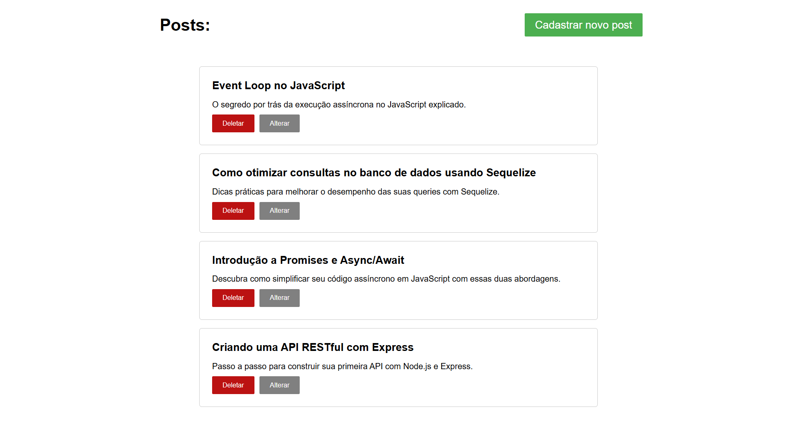

# Aplicação simples de postagens com Node.js, Express, Sequelize (MySQL) e Handlebars

Uma aplicação simples que consiste na criação de posts e visualização dos mesmos, usando as tecnologias citadas

## Como executar?

- Tenha o Node.js instalado
- Tenha o MySQL instalado
- Baixe o repositório
- Inicie o MySQL
- Crie uma base de dados
- Crie um arquivo `.env` na pasta root do projeto
- Insira as informações conforme o `.env.example`
- Entre na pasta através do terminal
- Digite `npm install` ou `npm i`
- Digite `npm run start`
- Clique na URL que aparecerá no terminal ou digite [http://localhost:3333](http://localhost:3333)

